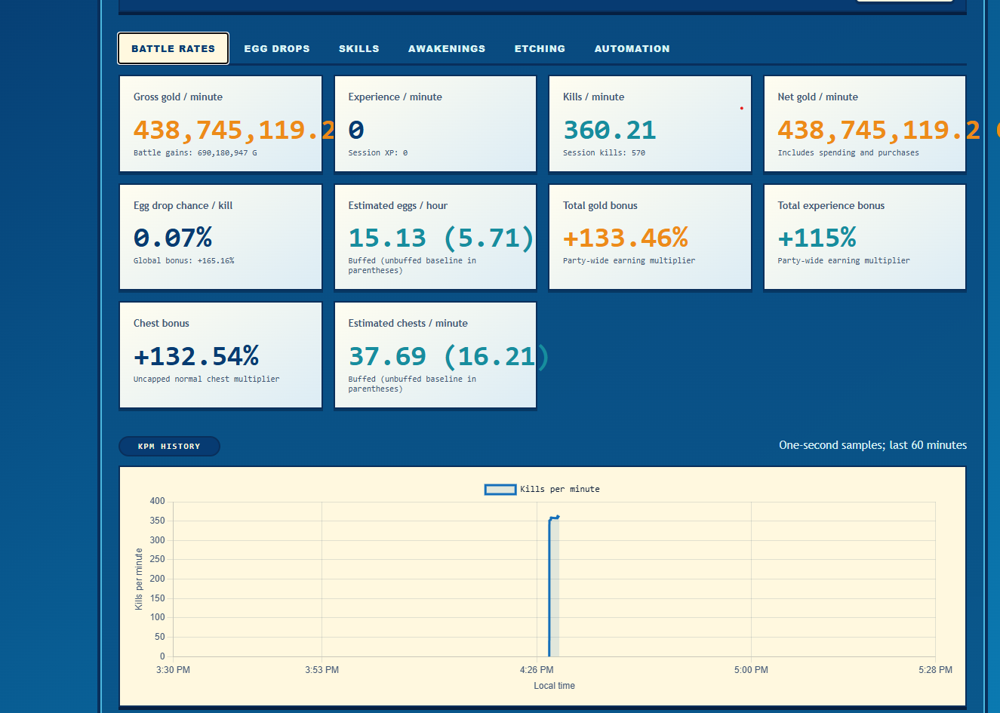
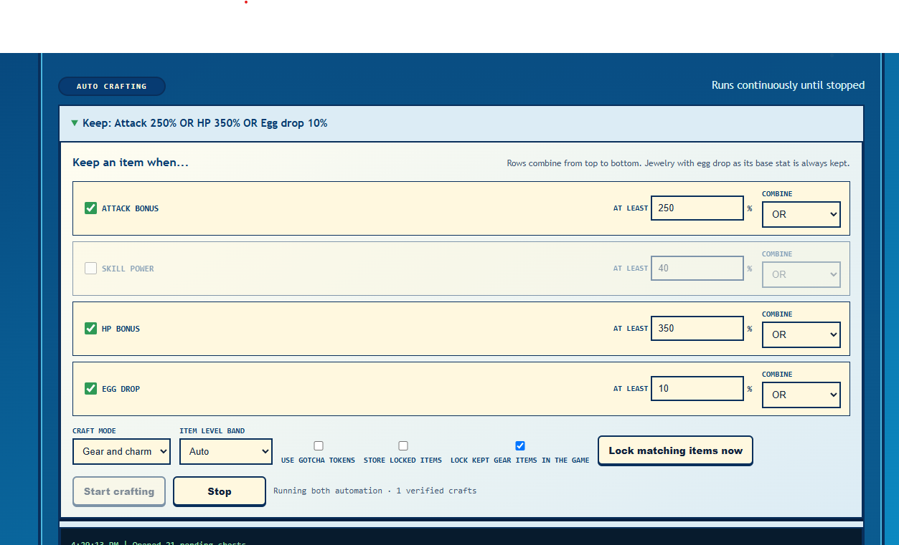
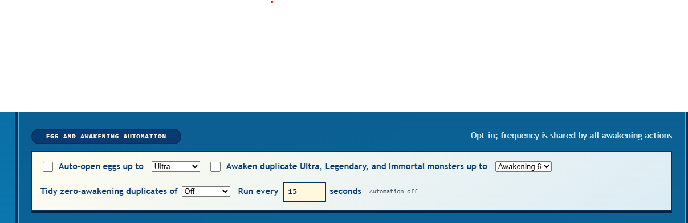
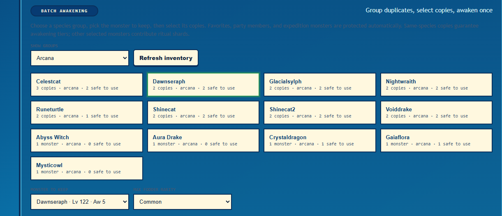

# TASMON Dashboard

A small local dashboard for viewing and automating TASMON.

## Requirements

- Windows with TASMON installed
- Node.js 22 or newer
- This project in the TASMON folder, beside `resources`

Expected layout:

```text
Taskbar Monsters/
   TaskbarMonsters.exe
   resources/
   info_project/
```

## Start

Open PowerShell in `info_project`.

Install dependencies once:

```powershell
npm install
```

Start TASMON in one PowerShell window:

```powershell
& "..\TaskbarMonsters.exe" --remote-debugging-port=9222
```

Start the dashboard in a second PowerShell window:

```powershell
npm start -- live
```

Open the dashboard:

[http://127.0.0.1:4173](http://127.0.0.1:4173)

Keep both PowerShell windows open while using the dashboard. Close the dashboard window first when finished, then close TASMON normally.

## Screens

### Dashboard



### Auto Craft



### Egg Opener



### Awakening



## Important

The dashboard can change the live game save. Export a save from TASMON before using crafting, locking, awakening, etching, or other automation features.
